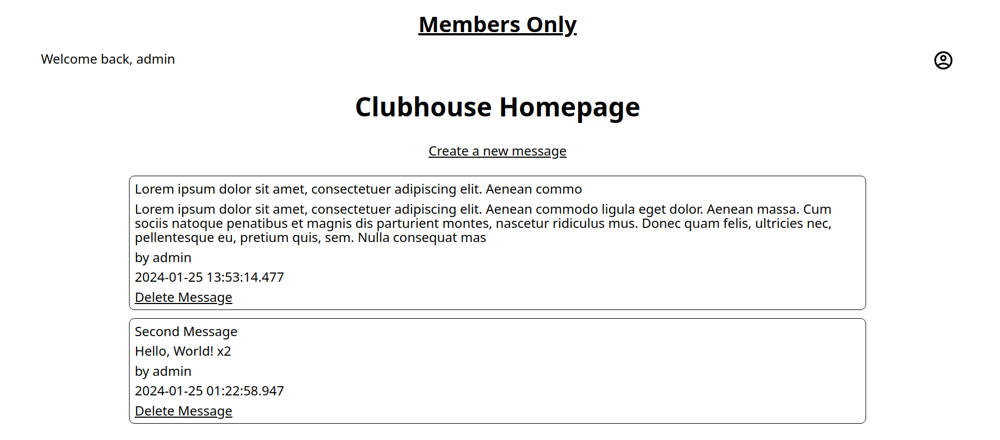

# Members Only

This project is an exclusive clubhouse where members can write anonymous posts. 
There are three different permission levels for users: Guest, Member and Admin.
Guests can create new posts.
Members can see post information like creation time, and author.
Admins can delete posts.
Users can navigate to the 'Join the Club' page in their profile, and enter a secret passcode to be given either the Member or Admin status if the passcode is correct.
The database is setup on MongoDB.

